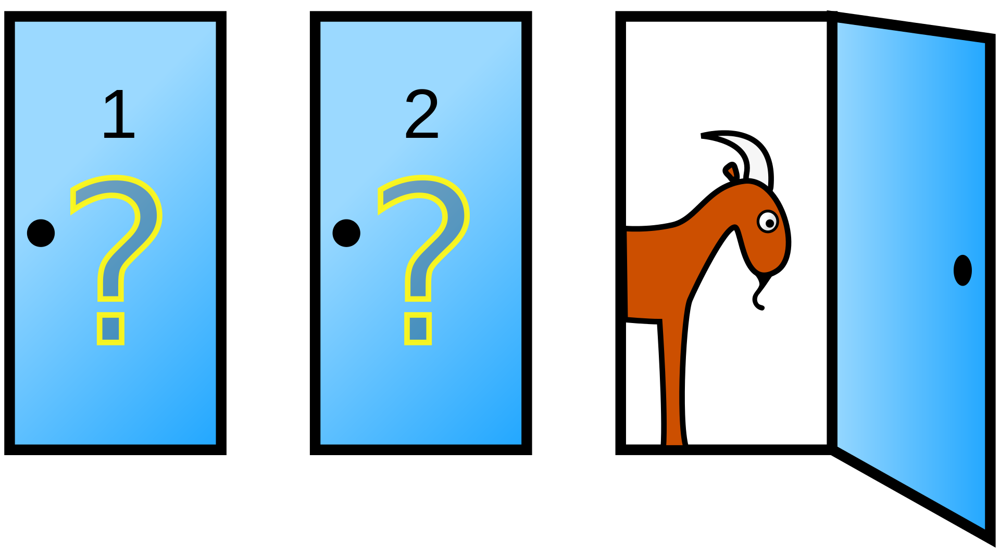

# Monty Hall Problem

The Monty Hall problem is a brain teaser, in the form of a probability puzzle, loosely based on the American television game show Let's Make a Deal and named after its original host, Monty Hall. 

# The Game/ Problem:
```
In search of a new car, the player picks a door, say 1. The game host then opens one of the other doors, say 3, to reveal a goat and offers to let the player switch from door 1 to door 2.
```

 ~[Image Source: Wiki]

**The question is: What should you do to maximize your chances of winning the car? Should you stick with your initial choice or switch doors, or does it even matter?**

# Solution

The counterintuitive answer to the Monty Hall problem is that you should always switch doors if you want to maximize your chances of winning the car. The reason behind this is based on probability:

When you initially choose a door, there's a 1/3 chance that you've picked the door with the car behind it and a 2/3 chance that you've chosen a door with a goat behind it.

When Monty Hall opens one of the other two doors to reveal a goat, the fact that he has revealed a goat provides additional information. It effectively "transfers" the 2/3 probability of choosing a door with a goat to the remaining unopened door. Therefore, the unopened door now has a 2/3 chance of hiding the car, while your initially chosen door still only has a 1/3 chance.

So, switching doors gives you a better chance (2/3) of winning the car compared to sticking with your initial choice (1/3). This result can be counterintuitive to some, but it can be demonstrated through probability theory and has been confirmed by simulations and real-world examples.

# Python Simulation

In the script, the simulation was run with 100 doors, and the results show that the probability of winning by sticking with the initial choice is very low (approximately 1.06%), while the probability of winning by switching doors is much higher (approximately 98.94%). This illustrates the well-known outcome of the Monty Hall problem, where switching doors is statistically the better strategy.

# Analysis

**Strategy 1**: Sticking with your initial choice

If you stick with your initial choice, you have a 1/3 chance of winning the car because there was a 1/3 chance that you initially picked the correct door. So, the probability of winning by sticking is 1/3.

**Strategy 2**: Switching doors

If you switch doors, you effectively bet that your initial choice was wrong. There was a 2/3 chance that you initially picked a goat. When the host reveals one of the other goat doors, you know that the remaining unopened door is the one with the car behind it. So, the probability of winning by switching is 2/3.

Therefore, **the optimal strategy is to switch doors if you want to maximize your chances of winning**. This conclusion often confuses people because it goes against their intuition, but it's supported by probability theory.

### Now, let's consider what happens if the number of doors is increased. Let's generalize the problem for 'n' doors:

You choose one of the 'n' doors.

The host, who knows what's behind all the doors, opens 'n-2' other doors, revealing 'n-2' goats. Importantly, the host will always reveal 'n-2' goats, and they know which door has the car behind it.

At this point, you have a choice: you can stick with your original choice or switch to one of the other unopened doors.

The key to understanding this generalization is that the probability of the car being behind your initially chosen door is 1/n, and the probability of the car being behind one of the other unopened doors is (n-1)/n.

By sticking with your initial choice, you have a 1/n chance of winning.

By switching doors, you effectively bet that your initial choice was wrong, so you have a (n-1)/n chance of winning.

As 'n' increases, the advantage of switching becomes more pronounced. When 'n' is small, like in the original Monty Hall problem with 3 doors, the difference between the probabilities of winning by sticking and switching may not seem significant. However, as 'n' grows larger, the probability of winning by switching approaches 1, while the probability of winning by sticking approaches 1/n, which becomes negligible. Therefore, for a large number of doors, it's almost always better to switch.